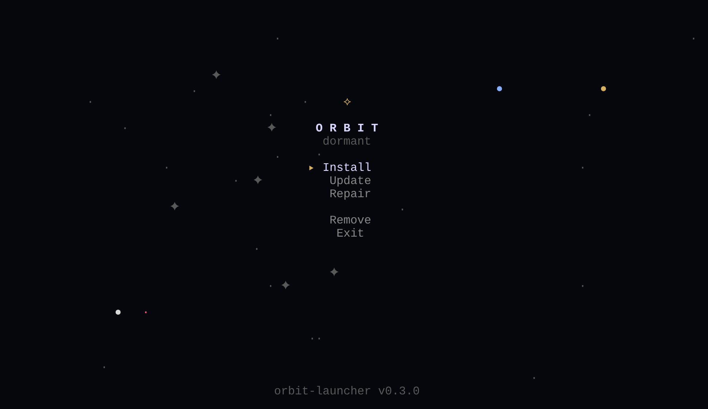
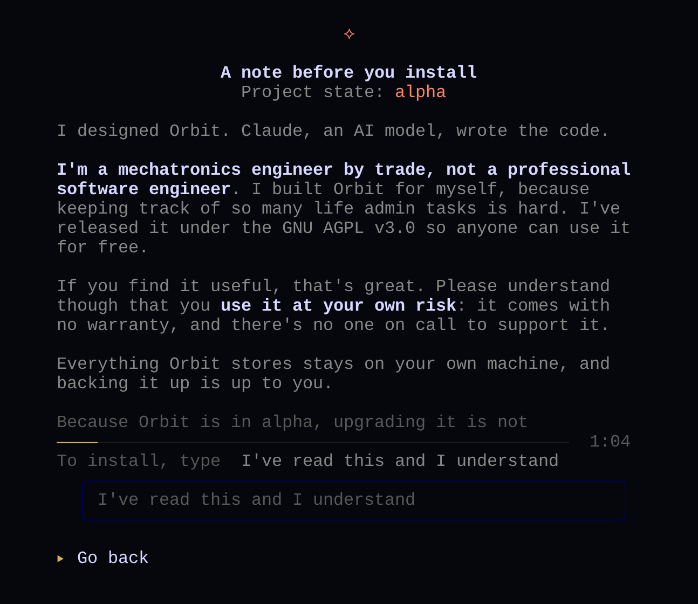
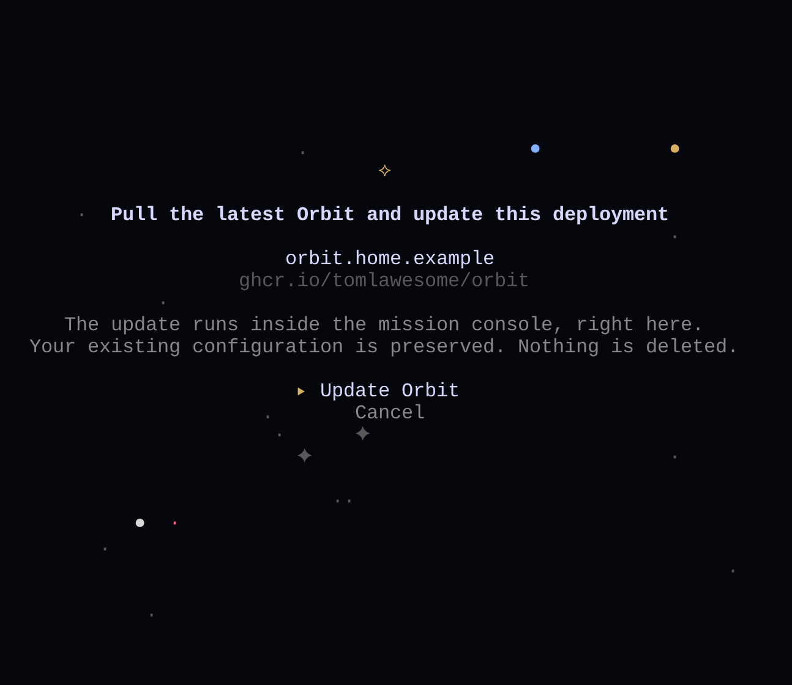

> [!IMPORTANT]
> **Development disclosure:** orbit-launcher was coded by Claude under human
> direction.

<h3>
  <a href="https://tomlawesome.github.io/orbit-site/">Website</a>
  &nbsp;&nbsp;·&nbsp;&nbsp;
  <a href="https://github.com/tomlawesome/orbit-launcher/security/policy">Report a vulnerability</a>
  &nbsp;&nbsp;·&nbsp;&nbsp;
  <a href="https://github.com/tomlawesome/orbit-launcher/blob/main/LICENSE">Licence</a>
</h3>

  <strong>orbit-launcher</strong> 
  The part of Orbit that sets it up and looks after it on your server.

 

  

&nbsp;

orbit-launcher is the full-screen terminal program that opens when you
install Orbit. It runs on the server that hosts Orbit and gives you a
short menu:

- **Install** sets Orbit up for the first time.
- **Update** brings an existing install up to the latest Orbit release.
- **Repair** checks the install for problems, shows what it would fix,
  and fixes the safe ones when you agree.
- **Remove** stops Orbit, then shows you the command that deletes it and
  its data. You decide whether to run it.

It ships with Orbit and is signed as part of each Orbit release. This
repository holds its source code, tests and version tags.
